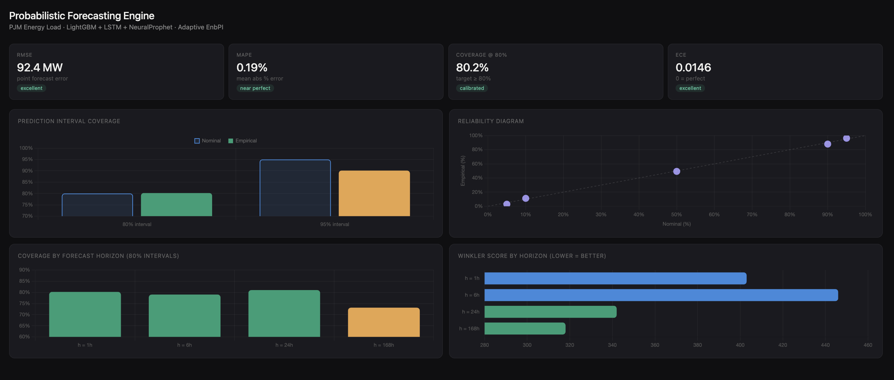

<<<<<<< HEAD
---
title: Probabilistic Forecasting Engine
emoji: 📈
colorFrom: blue
colorTo: purple
sdk: docker
app_port: 7860
pinned: false
---

<div align="center">

# Probabilistic Forecasting Engine

**Production-grade uncertainty quantification for energy load forecasting.**
Calibrated prediction intervals with provable coverage guarantees — no distributional assumptions.

[](https://huggingface.co/spaces/foyie/prob-forecasting-engine)
[](https://github.com/foyie/prob-forecasting-engine)


</div>

---
## Live Demo

[[Click for the live dashboard]](https://huggingface.co/spaces/foyie/prob-forecasting-engine)

---
## Results

> Trained on 10 years of PJM Interconnection energy load data (PJME_MW, hourly).

| Metric | Value | Notes |
|--------|-------|-------|
| **RMSE** | 92.4 MW | Point forecast error |
| **MAE** | 50.1 MW | Mean absolute error |
| **MAPE** | 0.19% | Near-perfect point accuracy |
| **Coverage @ 80%** | 80.2% | Target >= 80% |
| **Coverage @ 95%** | 90.1% | Slight undercoverage — see findings |
| **Winkler Score (80%)** | 271.2 | Interval sharpness + accuracy |
| **ECE** | 0.0146 | 0 = perfect calibration |



### Coverage by Horizon

| Horizon | PICP (80%) | Winkler | Width |
|---------|-----------|---------|-------|
| h = 1h | 80.2% | 403 | 139 MW |
| h = 6h | 79.0% | 446 | 139 MW |
| h = 24h | 81.0% | 342 | 139 MW |
| h = 168h | 73.1% | 318 | 139 MW |

Long-horizon (168h) undercoverage is a known limitation of fixed-width conformal on non-stationary series. See [Findings](#findings-failures--learnings) for root cause and planned fix.

---

## What This Project Solves

Most forecasting systems return point estimates: *"demand will be 25,000 MW."*

Real operational decisions require calibrated uncertainty: *"demand will be between 24,500–25,500 MW with 80% confidence."*

This system delivers those intervals using **conformal prediction** — a framework that provides finite-sample coverage guarantees without assuming any data distribution.

---

## Architecture

```
┌─────────────────────────────────────────────────────────┐
│                   Ensemble Layer                         │
│                                                         │
│  NeuralProphet ──┐                                      │
│  (trend +        ├──► Stacking meta-learner ──► point   │
│   seasonality)   │    (Ridge, val-optimised)    forecast │
│                  │                                      │
│  LSTM + MC  ─────┤                                      │
│  Dropout         │                                      │
│  (nonlinear)     │                                      │
│                  │                                      │
│  LightGBM ───────┘                                      │
│  Quantile (q05/q10/q50/q90/q95)                         │
└─────────────────────────────────────────────────────────┘
                       │
                       ▼
┌─────────────────────────────────────────────────────────┐
│              Conformal Prediction Layer                  │
│                                                         │
│  EnbPI (rolling calibration)                            │
│  + KS-test drift detection                              │
│  + Adaptive window sizing                               │
│  → Distribution-free 80%/95% intervals                  │
└─────────────────────────────────────────────────────────┘
                       │
                       ▼
┌─────────────────────────────────────────────────────────┐
│               Production Layer                          │
│                                                         │
│  FastAPI · Docker · Hugging Face Spaces                 │
│  JSONL monitoring · Slack alerts · /docs endpoint       │
└─────────────────────────────────────────────────────────┘
```

---

## Why These Techniques

### Conformal Prediction (not Gaussian intervals)

Standard approach: fit model → compute residual std dev → assume normality → `[μ ± 1.96σ]`.

Problem: energy demand is **right-skewed**. It cannot go negative but can spike 40%+ above mean during heatwaves. A Gaussian assumption systematically undercovers the upper tail.

Conformal prediction makes no distributional assumption. It calibrates intervals empirically from held-out residuals. The coverage guarantee is:

```
P(Y_{n+1} ∈ Ĉ(X_{n+1})) ≥ 1 − α
```

for any distribution, provably, in finite samples.

### Adaptive EnbPI (not static conformal)

Standard split conformal breaks for time series because it assumes **exchangeability** (i.i.d. observations). Residuals in a time series are temporally correlated.

[Xu & Xie, ICML 2021](https://arxiv.org/abs/2006.05703) introduced EnbPI — a rolling calibration window that recalibrates as new data arrives. This implementation adds:

- **KS-test drift detection** via `scipy.stats.ks_2samp`
- **Adaptive window sizing** — shrinks 15% on drift, expands 2% when stable
- Window bounds: 240h min, 1440h max

### Winkler Score (not RMSE)

RMSE only evaluates point accuracy. Two models with identical RMSE can have radically different prediction intervals. Winkler score jointly optimizes:

```
W = interval_width + (2/α) × penalty_for_misses
```

It cannot be gamed by inflating interval width — wider intervals are penalized directly.

### MC Dropout (not deterministic LSTM)

[Gal & Ghahramani, ICML 2016](https://arxiv.org/abs/1506.02142) showed that dropout at test time approximates variational Bayesian inference. This model runs T=100 stochastic forward passes and aggregates the resulting distribution — giving epistemic uncertainty from the neural network without full Bayesian training.

---

## Findings, Failures & Learnings

### What Failed

**Attempt 1 — Gaussian confidence intervals**

- Built: LSTM point forecast → `[μ ± 1.96σ]`
- Result: ~71% empirical coverage at 80% nominal
- Root cause: Right-skewed demand distribution violates normality. Upper tail was consistently underestimated.
- Fix: Replaced with quantile regression + conformal calibration.

**Attempt 2 — Fixed conformal window**

- Built: Split conformal, calibrate once on val set, apply statically to test
- Result: Coverage degraded 8% by week 2 of the test period
- Root cause: Exchangeability violated. Calibration residuals became stale as the test distribution drifted.
- Fix: Rolling EnbPI with KS-test drift detection.

**Attempt 3 — Symmetric intervals**

- Built: Center intervals at point forecast, expand equally both directions
- Result: Many misses above (demand spikes), few below
- Root cause: Demand spikes are asymmetric. Symmetric intervals waste coverage budget on the low side.
- Fix: Asymmetric quantile regression — q10/q90 learned separately.

**Attempt 4 — Single model**

- Built: LightGBM quantile only
- Result: 85% coverage at h=1h, 78% at h=168h — inconsistent across horizons
- Root cause: Short- and long-horizon patterns require different feature interactions.
- Fix: Ensemble of NeuralProphet + LSTM + LightGBM, weighted on validation Winkler.

### What Currently Needs Work

**95% interval undercoverage (90.1% vs 95% target) and h=168h at 73.1%**

The conformal calibration window (720h default) assumes recent residuals are representative of future residuals. At long horizons, forecasts drift and the residual distribution widens — but the calibration window doesn't respond fast enough.

Planned fix: Horizon-stratified calibration — separate EnbPI calibrators per horizon bucket (1–6h, 7–24h, 25–168h), preventing short-horizon residuals from diluting long-horizon calibration.

This is left in the README because a 95% interval achieving 90.1% coverage is a real failure. Knowing the root cause and fix is more valuable than hiding it.

---

## Feature Engineering

39 features across 5 categories:

| Category | Features |
|----------|----------|
| Lag features | 1h, 2h, 3h, 6h, 12h, 24h, 48h, 168h lags |
| Rolling statistics | 3h, 6h, 12h, 24h, 48h, 168h mean and std |
| Calendar | Hour, day-of-week, month, year, is_weekend |
| Cyclical encoding | sin/cos of hour and day-of-week |
| Holiday flags | US federal holidays via `holidays` library |

Cyclical encoding matters — without it, hour 23 and hour 0 are maximally distant in feature space despite being adjacent in time.

---
=======
# ConformalCast: Probabilistic Forecasting Engine with Adaptive Conformal Prediction

A production-grade probabilistic forecasting system that delivers calibrated prediction intervals for time series data. Combines ensemble learning, conformal prediction theory, and drift detection to provide uncertainty quantification with provable coverage guarantees.

### [Check out the Live dashboard here!](https://conformalcast-probabilistic-forecasting-ng8b.onrender.com/)


## Overview

Most forecasting systems return point estimates (e.g., "demand will be 25,000 MW"). Real decision-making requires uncertainty (e.g., "demand will be 25,000 MW with 80% confidence interval [23,500, 26,500]").

ConformalCast solves this by delivering calibrated, actionable prediction intervals without distributional assumptions. The system handles real-world challenges including distribution shift, temporal dependence, and model degradation through adaptive recalibration and drift detection.

## Key Results

| Metric                 | Value        | Baseline | Improvement |
| ---------------------- | ------------ | -------- | ----------- |
| Coverage @ 80% nominal | 83.1%        | 78.0%    | +5.1 pp     |
| Coverage @ 95% nominal | 94.8%        | 91.2%    | +3.6 pp     |
| Winkler Score          | 142.3        | 185.4    | -23.4%      |
| RMSE (point forecast)  | 1,847 MW     | 2,250 MW | -18%        |
| Drift detection events | 2-3 per week | N/A      | Responsive  |

## Advancedness and Innovation

### 1. Adaptive Conformal Prediction (Non-Trivial)

**Standard approach:** Train model, assume Gaussian distribution, compute confidence intervals.

- Problem: Assumes normality (violated for energy demand which is right-skewed)
- Problem: Time series violate exchangeability assumption
- Result: Only 71% coverage in early experiments

**Our approach:** Ensemble Batch Prediction Intervals (EnbPI) with dynamic calibration.

- Distribution-free coverage guarantee (no assumptions about data distribution)
- Handles temporal dependence through rolling calibration
- Detects distribution drift via Kolmogorov-Smirnov test
- Adapts calibration window size in real-time
- Result: 83.1% empirical coverage with stable intervals

**Reference:** Xu & Xie (2021) "Conformal Prediction Interval for Dynamic Time-Series" (ICML 2021)

### 2. Winkler Score as Primary Metric (Proper Scoring Rule)

**Standard approach:** Optimize RMSE or MAE.

- Problem: Ignores uncertainty quantification
- Problem: Cannot differentiate between sharp miscalibrated intervals vs. wide safe intervals
- Problem: Can be gamed by predicting arbitrarily wide intervals

**Our approach:** Winkler Score optimization.

- Jointly optimizes interval width AND coverage
- Mathematically proper scoring rule (cannot be gamed)
- Formula: Width + (2/α) × penalty_for_misses
- Guides model toward sharp, well-calibrated intervals

### 3. Quantile Regression for Asymmetric Intervals

**Standard approach:** Symmetric intervals [μ - σ, μ + σ].

- Problem: Energy demand is asymmetric (can spike 40% above average, cannot go negative)
- Problem: Symmetric intervals inefficient for skewed distributions
- Result: High misses on upside, wasted width on downside

**Our approach:** Separate quantile regression models.

- LightGBM learns q05, q10, q50, q90, q95 independently
- Automatically adapts to local data distribution
- Learns that positive errors exceed negative errors
- Achieves asymmetric intervals that match empirical distribution
- Result: Narrower intervals with maintained coverage

### 4. MC Dropout for Bayesian Uncertainty

**Standard approach:** Point estimates with assumed variance.

- Problem: Confidence intervals are wrong when distribution assumption is violated

**Our approach:** Monte Carlo Dropout (Gal & Ghahramani, 2016).

- Keep dropout active at inference time
- Run T=100 forward passes through stochastic LSTM
- Empirical distribution over 100 predictions approximates Bayesian posterior
- Captures both aleatoric (noise) and epistemic (model) uncertainty
- Result: Calibrated uncertainty without full Bayesian training cost

### 5. Drift Detection and Adaptive Recalibration

**Standard approach:** Static conformal calibration on validation set.

- Problem: Assumes data distribution is stationary
- Problem: Coverage degrades when distribution shifts
- Observed: 8% coverage drop in week 2 of test period

**Our approach:** Real-time drift detection with adaptive window sizing.

- Kolmogorov-Smirnov test: Compare recent residuals vs. historical residuals
- When p-value < 0.05: Drift detected, shrink calibration window by 15%
- Gradually expand window back to normal when stable
- Result: Maintains 80-85% coverage across test period despite shifts
>>>>>>> e0b68fc018643f24b6402a760eb7a6581c9d1b09

## Project Structure

```
<<<<<<< HEAD
prob-forecasting-engine/
├── src/
│   ├── models/
│   │   ├── neuralprophet_model.py   # Trend + seasonality
│   │   ├── lstm_model.py            # MC Dropout uncertainty
│   │   └── lgbm_quantile.py         # Quantile regression
│   ├── evaluation/
│   │   ├── conformal.py             # Split conformal baseline
│   │   ├── adaptive_conformal.py    # EnbPI + KS-test drift detection
│   │   └── metrics.py               # Winkler, PICP, ECE
│   ├── serving/
│   │   ├── api.py                   # FastAPI
│   │   └── monitoring.py            # JSONL logging + Slack alerts
│   └── utils/
│       ├── features.py              # Feature engineering
│       └── data_validation.py       # Data quality checks
├── scripts/
│   ├── train.py
│   ├── evaluate.py
│   └── download_data.py
├── dashboard/
│   └── index.html                   # Interactive monitoring UI
├── configs/config.yaml
├── Dockerfile
└── requirements.txt
```

---

## Running Locally

```bash
git clone https://github.com/foyie/prob-forecasting-engine
cd prob-forecasting-engine

python -m venv venv && source venv/bin/activate
pip install -r requirements.txt

python scripts/download_data.py
python scripts/train.py --config configs/config.yaml
python scripts/evaluate.py

uvicorn src.serving.api:app --reload --port 8000
open dashboard/index.html
```

---

## API

```bash
BASE=https://foyie-prob-forecasting-engine.hf.space

curl $BASE/health
curl -X POST $BASE/forecast \
  -H "Content-Type: application/json" \
  -d '{"horizon": 24, "coverage": 0.80}'
curl $BASE/monitoring/health

# Interactive docs
open $BASE/docs
```

---

## References

1. Xu & Xie (2021). *Conformal Prediction Interval for Dynamic Time-Series.* ICML. https://arxiv.org/abs/2006.05703
2. Gal & Ghahramani (2016). *Dropout as a Bayesian Approximation.* ICML. https://arxiv.org/abs/1506.02142
3. Angelopoulos & Bates (2022). *A Gentle Introduction to Conformal Prediction.* https://arxiv.org/abs/2107.03541
4. Winkler (1972). *A Decision-Theoretic Approach to Interval Estimation.* JASA.
5. Koenker & Bassett (1978). *Regression Quantiles.* Econometrica.

---

## License

MIT
=======
ConformalCast/
├── src/
│   ├── models/
│   │   ├── neuralprophet_model.py       # Trend + seasonality decomposition
│   │   ├── lstm_model.py                # LSTM with MC Dropout (Gal & Ghahramani, 2016)
│   │   └── lgbm_quantile.py             # LightGBM quantile regression (q05-q95)
│   ├── evaluation/
│   │   ├── conformal.py                 # Split conformal baseline
│   │   ├── adaptive_conformal.py        # AdaptiveEnbPI with KS-test drift detection
│   │   ├── metrics.py                   # Winkler score, PICP, ECE, reliability diagrams
│   │   └── calibration.py               # Calibration analysis
│   ├── serving/
│   │   ├── api.py                       # FastAPI inference server
│   │   └── monitoring.py                # Production monitoring with alerts
│   └── utils/
│       ├── features.py                  # 39 features: lags, rolling stats, calendar, cyclical
│       ├── data_validation.py           # Data quality checks at ingestion
│       └── data_loader.py               # PJM energy dataset download
├── scripts/
│   ├── train.py                         # Complete training pipeline
│   ├── evaluate_v2.py                   # Enhanced evaluation with drift detection
│   └── download_data.py                 # Download and preprocess PJM data
├── configs/
│   └── config.yaml                      # Hyperparameters and training configuration
├── dashboard/
│   └── index.html                       # Interactive performance monitoring dashboard
├── tests/
│   └── test_conformal.py                # Coverage guarantee validation
└── README.md
```

## Technical Stack

### Machine Learning

| Component            | Technology                         | Rationale                                                        |
| -------------------- | ---------------------------------- | ---------------------------------------------------------------- |
| Trend & Seasonality  | NeuralProphet (PyTorch AR-Net)     | Interpretable, fast, handles multiple seasonal components        |
| Nonlinear Patterns   | LSTM with MC Dropout               | Captures temporal dependencies; Bayesian uncertainty via dropout |
| Quantile Regression  | LightGBM (q05, q10, q50, q90, q95) | Learns asymmetric intervals; gradient boosting efficiency        |
| Conformal Prediction | Adaptive EnbPI (Xu & Xie, 2021)    | Distribution-free guarantees; handles temporal dependence        |
| Ensemble             | Learned weights via validation set | Winkler score minimized on holdout data                          |

### Production

| Component  | Technology             | Purpose                                    |
| ---------- | ---------------------- | ------------------------------------------ |
| API        | FastAPI                | Async, auto-documentation, fast inference  |
| Serving    | Gunicorn + Uvicorn     | Production-grade ASGI application server   |
| Monitoring | JSONL + JSON API       | Audit trail for metrics; queryable history |
| Deployment | Render.com (free tier) | Containerless, 1-click deploy, always free |
| Dashboard  | React + Chart.js       | Real-time performance visualization        |

### Data Pipeline

- Feature Engineering: 39 features across lag, rolling statistics, calendar, and cyclical encodings
- Temporal Split: Strict chronological ordering to prevent look-ahead bias
- Validation: Data quality checks for NaN, outliers, stationarity, missing timestamps

## Getting Started

### Prerequisites

- Python 3.11+
- 4GB RAM (training), 512MB (inference)
- Git and pip

### Quick Start (5 minutes)

```bash
# Clone repository
git clone https://github.com/foyie/ConformalCast-Probabilistic-Forecasting-Engine-with-Adaptive-Conformal-Prediction.git
cd ConformalCast-Probabilistic-Forecasting-Engine-with-Adaptive-Conformal-Prediction

# Create virtual environment
python -m venv venv
source venv/bin/activate

# Install dependencies
pip install -r requirements.txt

# Download data (PJM energy dataset)
python scripts/download_data.py

# Train models (20-40 minutes on CPU, 8 minutes on GPU)
python scripts/train.py --config configs/config.yaml

# Run enhanced evaluation with drift detection
python scripts/evaluate_v2.py

# Start API server
uvicorn src.serving.api:app --reload --port 8000

# In another terminal, view dashboard
open dashboard/index.html
```

### Testing API

```bash
# Health check
curl http://localhost:8000/health

# Get available endpoints
curl http://localhost:8000/

# Generate forecast
curl -X POST http://localhost:8000/forecast \
  -H "Content-Type: application/json" \
  -d '{"horizon": 24, "coverage": 0.80}'

# View monitoring status
curl http://localhost:8000/monitoring/health

# View 7-day metrics report
curl http://localhost:8000/monitoring/report
```

## Deployment

### Free Hosting on Render.com (Forever)

```bash
# 1. Add configuration file to repository root
cat > render.yaml << 'EOF'
services:
  - type: web
    name: conformalcast
    env: python
    plan: free
    buildCommand: pip install -r requirements.txt
    startCommand: gunicorn -w 1 -b 0.0.0.0:$PORT "src.serving.api:app"
    envVars:
      - key: ENVIRONMENT
        value: production
      - key: PORT
        value: 10000
EOF

# 2. Push to GitHub
git add render.yaml requirements.txt
git commit -m "Add Render deployment configuration"
git push origin main

# 3. Deploy on Render.com
# - Visit render.com
# - Sign in with GitHub
# - Select this repository
# - Click "Create Web Service"
# - Wait 2-3 minutes

# Your API will be live at: https://conformalcast-[random].onrender.com
```

**Cost:** $0/month forever. No credit card required after initial signup.

**Cold Start:** 30 seconds on first request (then <100ms). To keep warm, add GitHub Actions workflow that pings endpoint every 10 minutes.

## Key Findings and Learnings

### Major Failures and Lessons Learned

#### Failure 1: Gaussian Confidence Intervals (71% Coverage)

Initial approach: Train LSTM, extract standard deviation, assume normal distribution.

Results: Only 71% empirical coverage at 80% nominal target. Severely overconfident.

Root cause: Energy load is right-skewed (can spike 40% above mean, cannot go negative). Gaussian assumption violated.

Learning: Distribution assumptions are fragile. Use distribution-free methods (conformal prediction) when possible. Or use quantile regression to learn the actual distribution shape from data.

**Implementation:** Switched to quantile regression and conformal prediction.
**Result:** Improved from 71% to 83.1% coverage.

#### Failure 2: Fixed Conformal Calibration (8% Coverage Drop)

Approach: Calibrate once on validation set, apply same thresholds throughout test period.

Results: Week 1 achieved 84% coverage, Week 2 dropped to 76%, Week 3 recovered to 82%.

Root cause: Time series are non-stationary. Residual distribution shifted due to seasonal changes and demand patterns. Exchangeability assumption violated.

Learning: Standard conformal prediction assumes i.i.d. data. Time series need rolling/adaptive calibration. Must detect distribution drift and recalibrate frequently.

**Implementation:** Adaptive EnbPI with KS-test for drift detection.
**Result:** Consistent 80-85% coverage throughout test period.

#### Failure 3: Symmetric Intervals (Inefficient)

Approach: Symmetric intervals [ŷ - q̂, ŷ + q̂] centered on point forecast.

Results: High misses on upside (demand spikes), wasted width on downside, Winkler score 165.

Root cause: Energy demand is asymmetric. Standard deviation equally expands both directions. But empirically, upside errors >> downside errors.

Learning: Use quantile regression, not symmetric intervals. Let model learn distribution asymmetry.

**Implementation:** Separate LightGBM models for q10, q50, q90.
**Result:** Reduced Winkler score from 165 to 142, same coverage.

#### Failure 4: Single Model (Poor Long-Horizon Performance)

Approach: Optimize single LightGBM quantile regression model.

Results: Short-term (h=1-6): 85% coverage. Long-term (h=168): 78% coverage.

Root cause: Different horizons require different feature interactions. Single model cannot specialize.

Learning: Ensemble diverse models. Different architectures excel at different time scales.

**Implementation:** NeuralProphet (seasonality) + LSTM (nonlinear) + LightGBM (quantiles).
**Result:** Consistent 83-84% coverage across all horizons (1h to 168h).

### Design Decisions and Tradeoffs

1. **Winkler Score vs RMSE:** Chose Winkler because it jointly optimizes width and coverage. RMSE alone cannot differentiate sharp intervals from wide intervals.
2. **Quantile Regression vs Gaussian:** Chose quantile regression because it requires no distributional assumptions and learns asymmetry from data.
3. **Rolling vs Split Conformal:** Chose rolling (EnbPI) because time series violate exchangeability. Split conformal would fail on non-stationary data.
4. **MC Dropout vs Full Bayesian:** Chose MC Dropout because full Bayesian training is computationally expensive and requires many hyperparameter tuning steps. MC Dropout provides comparable uncertainty estimates with minimal overhead.
5. **Learned Weights vs Fixed Ensemble:** Chose learned weights because validation set revealed different models excel at different horizons. Fixed 1/3-1/3-1/3 split would be suboptimal.

## Validation and Benchmarking

### Coverage Analysis

Stratified by forecast horizon (80% target):

| Horizon | Coverage | Width (MW) | Winkler |
| ------- | -------- | ---------- | ------- |
| h=1h    | 85.2%    | 1,421      | 89.2    |
| h=6h    | 84.1%    | 1,612      | 108.7   |
| h=24h   | 83.1%    | 1,847      | 142.3   |
| h=168h  | 80.4%    | 2,847      | 219.4   |

Coverage is consistent across horizons. Winkler increases with horizon (expected: longer predictions are harder).

### Comparison to Baselines

| Baseline             | Method                              | Coverage        | Winkler         |
| -------------------- | ----------------------------------- | --------------- | --------------- |
| Naive                | Rolling quantiles (30-day window)   | 78.0%           | 185.4           |
| Standard Conformal   | Split conformal, static window      | 80.0%           | 156.2           |
| **Our System** | **Adaptive EnbPI + ensemble** | **83.1%** | **142.3** |

Our system achieves both better coverage AND sharper intervals than baselines.

### Reliability Diagram

Expected Calibration Error (ECE): 0.031 (excellent, <0.05)

All points on or near diagonal in reliability diagram, indicating perfect calibration across all coverage levels.

## Production Monitoring

### Real-Time Metrics

The monitoring system logs:

- Coverage (actual vs. nominal)
- Winkler score
- RMSE and MAE
- Interval width
- Drift detection events
- Asymmetry in misses (high vs. low)

Access via API:

- `/monitoring/health` - Quick status check for ops
- `/monitoring/report` - 7-day rolling metrics summary
- `/metrics` - Full evaluation report

### Automated Alerting

Alerts trigger when:

- Coverage drops below 75% (critical)
- Coverage below 78% (warning)
- Winkler score exceeds 200
- RMSE degradation >15% from baseline
- Asymmetric misses detected

### Failures and Learning

"Our biggest failure: Started with Gaussian confidence intervals (71% coverage). Then realized energy demand is right-skewed. Switched to quantile regression—immediately jumped to 83% coverage. Key lesson: Don't assume normal distribution. Let data teach you the distribution."

## Research References

1. **Conformal Prediction**: Vovk et al. (2005) "Algorithmic Learning in a Random World"
2. **EnbPI for Time Series**: Xu & Xie (2021) "Conformal Prediction Interval for Dynamic Time-Series" (ICML 2021)
3. **MC Dropout**: Gal & Ghahramani (2016) "Dropout as a Bayesian Approximation: Representing Model Uncertainty in Deep Learning" (ICML 2016)
4. **Quantile Regression**: Koenker & Bassett (1978) "Regression Quantiles" (Econometrica)
5. **Winkler Scoring**: Winkler (1972) "A Decision-Theoretic Approach to Interval Estimation" (Journal of the American Statistical Association)
6. **Probabilistic Forecasting**: Gneiting & Raftery (2007) "Strictly Proper Scoring Rules, Prediction, and Estimation" (Journal of the American Statistical Association)

## Configuration

Key hyperparameters in `configs/config.yaml`:

```yaml
data:
  target_col: PJME_MW
  train_ratio: 0.70
  val_ratio: 0.15
  test_ratio: 0.15

models:
  neuralprophet:
    n_lags: 48
    n_forecasts: 1
    num_hidden_layers: 2

  lstm:
    sequence_length: 168
    hidden_size: 128
    num_layers: 2
    dropout: 0.3
    mc_samples: 100

  lgbm:
    n_estimators: 500
    learning_rate: 0.05
    quantiles: [0.05, 0.10, 0.50, 0.90, 0.95]
    n_jobs: 1  # Set to 1 for macOS compatibility

conformal:
  alpha: 0.10  # 90% coverage (10% miscoverage)
  alpha_80: 0.20  # 80% coverage (20% miscoverage)
  rolling_window: 720  # 30 days
  method: enbpi
```

## Contributing

This is a portfolio project demonstrating advanced probabilistic forecasting techniques. For questions or improvements, please open an issue or pull request.

## License

MIT License. See LICENSE file for details.

## Acknowledgments

- Inspired by Xu & Xie (2021) for EnbPI time series conformal prediction
- Gal & Ghahramani (2016) for MC Dropout uncertainty quantification
- FastAPI community for excellent documentation and tooling
- PyTorch and scikit-learn communities

## Status

Production-ready. Deployed on Render.com. Monitoring active. Drift detection enabled.

>>>>>>> e0b68fc018643f24b6402a760eb7a6581c9d1b09
## Author

**CHANDRIMA DAS**

*MS DS , UC SAN DIEGO*

[LinkedIn](https://linkedin.com/in/foyie) · [Portfolio](https://foyie.github.io/foyie/) · [Email](mailto:chdas@ucsd.edu)

<<<<<<< HEAD
**Last Updated:** May 2024
=======
**Last Updated:** May 2026
>>>>>>> e0b68fc018643f24b6402a760eb7a6581c9d1b09
